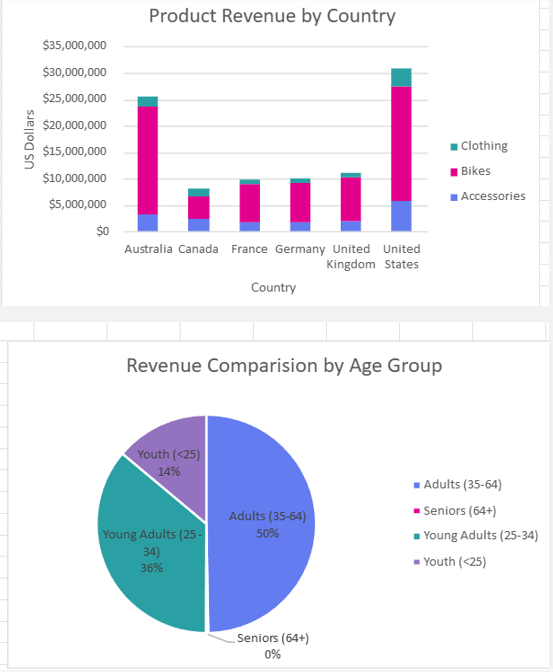
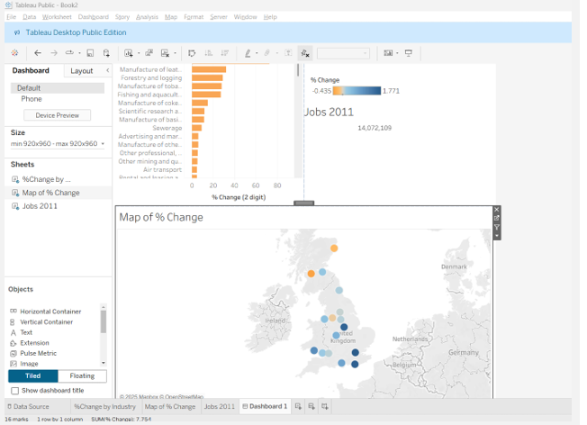
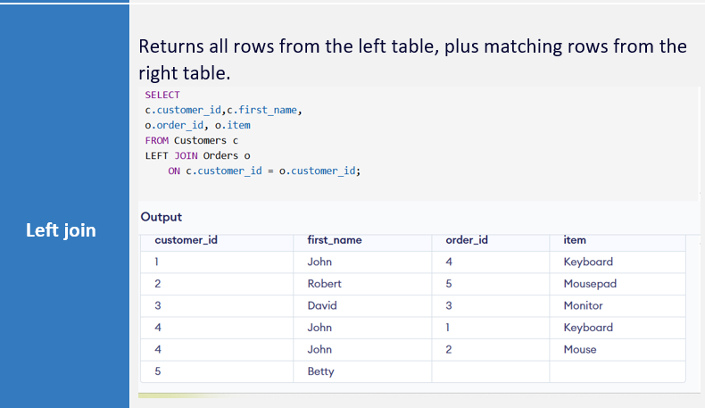
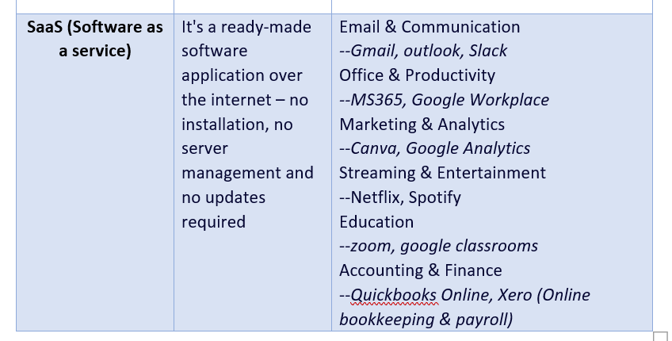
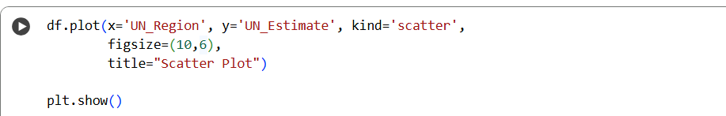
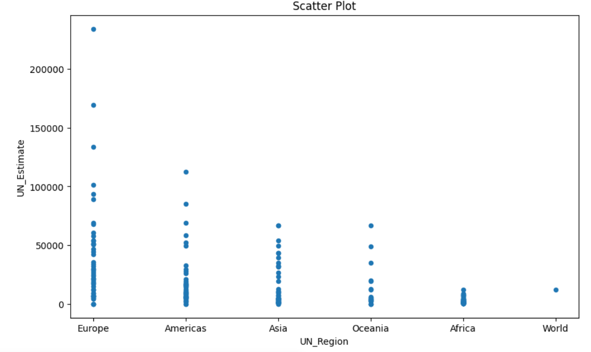

# 📊 parameswari-hub/WorkBooks-Repo: My Data Bootcamp Projects

This repository serves as a portfolio showcasing my hands-on experience and skills gained during a comprehensive data bootcamp. It covers the **end-to-end analytics lifecycle**, from data preparation to interactive reporting and cloud storage.

---

## 🚀 Overview
I learned to clean and prepare data in **Excel** and **Python** , write efficient **SQL** queries to retrieve and aggregate information from relational databases , and design interactive dashboards with **Power BI** and **Tableau**. I also worked with **Azure** cloud services to understand how to store and serve data for scalable analysis and reporting.

My practical work includes:
* Building pivot-driven dashboards and Excel reports.
* Automating data transforms with pandas in Python.
* Combining and summarizing data with `JOIN` and `GROUP BY` in SQL.
* Creating interactive, filterable dashboards for storytelling with Power BI and Tableau.

---

## 📚 Bootcamp Modules and Projects

### 🟦 Week 1 — Excel

| Topic | Core Skills | Key Takeaways |
| :--- | :--- | :--- |
| **Data Preparation** |  Excel formulas (SUM, AVERAGE, IF)    , data cleaning (text-to-columns, remove duplicates)  , and conditional formatting  . |  I can quickly prepare and summarize tabular data, create repeatable reports using pivot tables, and use visualizations effectively to highlight insights.|
| **Reporting & Visuals** |  Pivot tables     and basic charts (bar, line, pie)  . |  Create repeatable reports with pivot tables and use visualizations to highlight insights . |

---

### 🟩 Week 2 — Power BI & Tableau
 

| Topic | Core Skills | Key Takeaways |
| :--- | :--- | :--- |
| **Modeling & Visualization** |  Connecting to data sources    , data modeling basics (relationships)    , and creating visualizations (bar/line/maps/heatmaps)  . |  How to build interactive reports that let stakeholders explore data   . |
| **Interactivity** |  Filters & slicers    , publishing/sharing dashboards    , and storytelling through multiple linked visualizations. | I can build interactive reports that empower stakeholders to explore data and understand the strengths of both Power BI and Tableau for visual analysis and dashboarding . |

 
Power BI:

Tableau:

---

### 🟪 Week 3 — SQL

| Topic | Core Skills | Key Takeaways |
| :--- | :--- | :--- |
| **Query Fundamentals** |  `SELECT`, `WHERE`, `ORDER BY`           , aggregate functions (COUNT, SUM, AVG)         . |  I wrote queries to filter and aggregate large datasets, joined multiple tables to create combined reports, and utilized GROUP BY to produce summary metrics for business questions..|
| **Advanced Queries** |  `JOIN` (INNER/LEFT/RIGHT)           , `GROUP BY`, `HAVING`           , and subqueries         . | I am proficient in translating business questions into effective SQL queries to retrieve accurate, aggregated results from databases. . |

### Screenshot

---

### 🟨 Week 4 — Azure (Cloud Fundamentals)

| Topic | Core Skills | Key Takeaways |
| :--- | :--- | :--- |
| **Cloud Services** |  Storage options (Blob, Data Lake)       , compute options (VMs, App Services)       , and managed data services (Azure SQL, Synapse)     . |  How cloud services fit into a data workflow for scalable analytics    . |
| **Data Deployment** |  Intro to deploying data pipelines and storing datasets in the cloud      . |  Understanding where to host/process data and basic security/auth (service principals, keys). |

### Screenshot

---

### 🐍 Week 5 — Python

| Topic | Core Skills | Key Takeaways |
| :--- | :--- | :--- |
| **Data Analysis** |  `pandas` (DataFrame operations, grouping, merging)          , data cleaning        . |  Manipulate and analyze datasets programmatically. |
| **Scripting & Visuals** |  Basic plotting (matplotlib/seaborn)          , writing reusable functions and scripts        . |  Automate repetitive data tasks and prepare analysis-ready data for reporting. |

### Screenshot

---
***Note on Images:*** *For the screenshots to display correctly, please ensure the image files (e.g., `Excel.png`, `PowerBI.png`, etc.) are uploaded to the same directory as this `README.md` file.*
